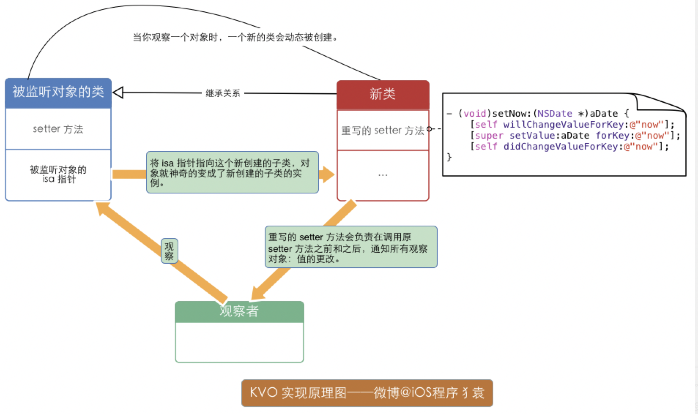

KVO的流程图


# 一. KVO的定义

> `Key-value observing` is a mechanism that allows objects to be notified of changes to specified properties of other objects.

`KVO (Key-value observing)` 是一个非正式协议，允许对象在其他对象的指定属性发生更改时得到通知。iOS开发者可以使用`KVO` 来检测对象属性的变化、快速做出响应，这能够为我们在开发强交互、响应式应用以及实现视图和模型的双向绑定时提供大量的帮助。

> KVO’s primary benefit is that you don’t have to implement your own scheme to send notifications every time a property changes. Its well-defined infrastructure has framework-level support that makes it easy to adopt—typically you do not have to add any code to your project. In addition, the infrastructure is already full-featured, which makes it easy to support multiple observers for a single property, as well as dependent values.

`KVO`的主要好处是，不必在每次属性更改时都实现自己的方案来发送通知。这个过程大部分是内建的，自动的，透明的。这使得采用它很容易，通常您不必向项目中添加任何代码。此外，KVO支持单个属性添加多个观察者以及依赖值。

# 二. 注册KVO -- Registering for Key-Value Observing

## 2.1 注册观察者 -- Registering as an Observer

```
- (void)addObserver:(NSObject *)observer
         forKeyPath:(NSString *)keyPath
            options:(NSKeyValueObservingOptions)options
            context:(void *)context;
复制代码
```

- `observer`: 注册 KVO 通知的对象。观察者必须实现 `key-value observing` 方法 - `observeValueForKeyPath:ofObject:change:context:`。
- `keyPath`: 被观察者的属性的 `keypath`，相对于接受者，值不能是 nil。
- `options`: 代表 `NSKeyValueObservingOptions` 的位掩码，它指定了观察通知中包含了什么
- `context` :在 `observeValueForKeyPath:ofObject:change:context:` 传给 `observer` 参数的上下文

### 2.1.1 更好的 keyPath

传字符串做为 keypath 比直接使用属性更糟糕，因为任何错字或者拼写错误都不会被编译器察觉，最终导致不能正常工作。 一个聪明的解决方案是使用 `NSStringFromSelector` 和一个 `@selector` 字面值:

```
NSStringFromSelector(@selector(isFinished))
复制代码
```

因为 `@selector` 检查目标中的所有可用 `selector`，这并不能阻止所有的错误，但它可以用来捕获大部分改变。

### 2.1.2 更好的 context

关于context，苹果官方文档也做了精彩的注释。

> The context pointer in the addObserver:forKeyPath:options:context: message contains arbitrary data that will be passed back to the observer in the corresponding change notifications. You may specify NULL and rely entirely on the key path string to determine the origin of a change notification, but this approach may cause problems for an object whose superclass is also observing the same key path for different reasons.

`context` 中包含着将在相应的更改通知中传递回观察员的任意数据。您可以指定NULL并完全依赖于`keyPath`确定更改通知的来源。但是这种方法可能出现问题：**尤其是处理那些继承自同一个父类的子类，并且这些子类有相同的 `keypath`。**

> A safer and more extensible approach is to use the context to ensure notifications you receive are destined for your observer and not a superclass.

一种更安全、更可扩展的方法是：使用`context`来确保接收到的通知是发送给观察者的，而不是发送给超类。 如何设置一个好的 `content` 呢？苹果官方文档也给出了推荐的方法。

```
//  a Person instance registers itself as an observer for an Account instance’s
// 大体意思就是：一个静态变量存着它自己的指针。这意味着它自己什么也没有。
static void *PersonAccountBalanceContext = &PersonAccountBalanceContext;
static void *PersonAccountInterestRateContext = &PersonAccountInterestRateContext;

- (void)registerAsObserverForAccount:(Account*)account {
    [account addObserver:self
              forKeyPath:@"balance"
                 options:(NSKeyValueObservingOptionNew |
                          NSKeyValueObservingOptionOld)
                 context:PersonAccountBalanceContext];
 
    [account addObserver:self
              forKeyPath:@"interestRate"
                 options:(NSKeyValueObservingOptionNew |
                          NSKeyValueObservingOptionOld)
                  context:PersonAccountInterestRateContext];
}
复制代码
```

## 2.2 接受变化 -- Receiving Notification of a Change

```
- (void)observeValueForKeyPath:(NSString *)keyPath
                      ofObject:(id)object
                        change:(NSDictionary *)change
                       context:(void *)context {
 
    if (context == PersonAccountBalanceContext) {
        // Do something with the balance…
 
    } else if (context == PersonAccountInterestRateContext) {
        // Do something with the interest rate…
 
    } else {
        // Any unrecognized context must belong to super
        [super observeValueForKeyPath:keyPath
                             ofObject:object
                               change:change
                               context:context];
    }
}
复制代码
```

## 2.3 移除观察者 -- Removing an Object as an Observer

苹果官方文档推荐在 `init` 或 `viewDidLoad` add观察者，在 `dealloc` 里移除观察者, 保证 `add` 和 `remove` 是成对出现的。

```
- (void)unregisterAsObserverForAccount:(Account*)account {
    [account removeObserver:self
                 forKeyPath:@"balance"
                    context:PersonAccountBalanceContext];
 
    [account removeObserver:self
                 forKeyPath:@"interestRate"
                    context:PersonAccountInterestRateContext];
}
复制代码
```

### 更好的remove

调用 `–removeObserver:forKeyPath:context:`时， 当这个对象没有被注册为观察者（因为它已经解注册了或者开始没有注册），会抛出一个异常。有意思的是，没有一个内建的方式来检查对象是否注册。 苹果官方文档推荐使用： `@try` / `@catch` 移除观察者。

```
- (void)dealloc {
    @try {
        // 3. unsubscribe
        [_account removeObserver:self
                      forKeyPath:NSStringFromSelector(@selector(contentSize))
                         context:ContentSizeContext];
    }
    @catch (NSException *exception) {
        
    }
}
复制代码
```

# 三. KVO兼容 -- KVO Compliance

> To use KVO, first you must ensure that the observed object, the Account in this case, is KVO compliant. Typically, if your objects inherit from NSObject and you create properties in the usual way, your objects and their properties will automatically be KVO Compliant. It is also possible to implement compliance manually. KVO Compliance describes the difference between automatic and manual key-value observing, and how to implement both.

要使用`KVO`，首先必须确保被观察的对象符合`KVO`。通常，如果您的对象继承自`NSObject`，并且您以通常的方式创建属性，那么您的对象及其属性将自动与`KVO`兼容。当然，也可以手动实现遵从性。`KVO Compliance`讲述述了自动和手动键值观察之间的区别，以及如何实现两者。

可以通过复写 `automaticallyNotifiesObserversForKey:` 的返回值，选择自动退出 KVO。同时该类方法还能完成控制特定属性的目的。

```
+ (BOOL)automaticallyNotifiesObserversForKey:(NSString *)theKey {
 
    BOOL automatic = NO;
    if ([theKey isEqualToString:@"balance"]) {
        automatic = NO;
    } else {
        automatic = [super automaticallyNotifiesObserversForKey:theKey];
    }
    return automatic;
}
复制代码
```

## 3.1 自动KVO -- Automatic Change Notification

```
// Call the accessor method.
[account setName:@"Savings"];
 
// Use setValue:forKey:.
[account setValue:@"Savings" forKey:@"name"];
 
// Use a key path, where 'account' is a kvc-compliant property of 'document'.
[document setValue:@"Savings" forKeyPath:@"account.name"];
 
// Use mutableArrayValueForKey: to retrieve a relationship proxy object.
Transaction *newTransaction = <#Create a new transaction for the account#>;
NSMutableArray *transactions = [account mutableArrayValueForKey:@"transactions"];
[transactions addObject:newTransaction];
复制代码
```

**注：** 可不数组直接addObject不会触发kvc，所以也不会触发kvo

## 3.2 手动KVO -- Manual Change Notification

手动 KVO 可以帮助我们将多个属性值的更改合并成一个，这样在回调的时候就有一次了，同时也能最大程度地减少处于应用程序特定原因而导致的通知发生。

- 要实现手动观察者通知，请在更改值之前调用`willChangeValueForKey`，在更改值之后调用`didChangeValueForKey`

```
- (void)setBalance:(double)theBalance {
    [self willChangeValueForKey:@"balance"];
    _balance = theBalance;
    [self didChangeValueForKey:@"balance"];
}
复制代码
```

- 为了性能最佳，通过检查值是否发生变化，最小化发送不必要的通知

```
- (void)setBalance:(double)theBalance {
    if (theBalance != _balance) {
        [self willChangeValueForKey:@"balance"];
        _balance = theBalance;
        [self didChangeValueForKey:@"balance"];
    }
}
复制代码
```

- 如果一个操作导致多个键发生更改，应该这样更改

```
- (void)setBalance:(double)theBalance {
    [self willChangeValueForKey:@"balance"];
    [self willChangeValueForKey:@"itemChanged"];
    _balance = theBalance;
    _itemChanged = _itemChanged+1;
    [self didChangeValueForKey:@"itemChanged"];
    [self didChangeValueForKey:@"balance"];
}
复制代码
```

- 对于有序的一对多关系属性，不仅必须指定已更改的键，还必须指定更改的类型和所涉及对象的索引。 更改的类型是 `NSKeyValueChange`（ `NSKeyValueChangeInsertion`，`NSKeyValueChangeRemoval` 或 `NSKeyValueChangeReplacement`），受影响的对象的索引用 `NSIndexSet` 对象

```
- (void)removeTransactionsAtIndexes:(NSIndexSet *)indexes {
    [self willChange:NSKeyValueChangeRemoval
        valuesAtIndexes:indexes forKey:@"transactions"];
 
    // Remove the transaction objects at the specified indexes.
 
    [self didChange:NSKeyValueChangeRemoval
        valuesAtIndexes:indexes forKey:@"transactions"];
}
复制代码
```

# 四. 注册依赖键 -- Registering Dependent Keys

有一些属性的值取决于一个或者多个其他对象的属性值，一旦某个被依赖的属性值变了，依赖它的属性的变化也需要被通知。

## 4.1 To-One Relationships

要自动触发 `To-One` 关系，有两种方法：

- 重写 `keyPathsForValuesAffectingValueForKey:`方法
- 定义名称为 `keyPathsForValuesAffecting` 的方法。

举个例子： 一个人的全名 fullName 是由 firstName 和 lastName 组成的，一个观察 fullName 的程序在 firstName 或者 lastName 变化时也应该接收到通知。

```
- (NSString *)fullName
{
    return [NSString stringWithFormat:@"%@ %@",firstName, lastName];
}
复制代码
```

1. 方法一：重写 `keyPathsForValuesAffectingValueForKey:`方法, 来表明 fullname 属性是依赖于 firstname 和 lastname 的：

```
+ (NSSet *)keyPathsForValuesAffectingValueForKey:(NSString *)key {
 
    NSSet *keyPaths = [super keyPathsForValuesAffectingValueForKey:key];
 
    if ([key isEqualToString:@"fullName"]) {
        NSArray *affectingKeys = @[@"lastName", @"firstName"];
        keyPaths = [keyPaths setByAddingObjectsFromArray: affectingKeys];
    }
    return keyPaths;
}
复制代码
```

相当于在影响 fullName 值的 keypath 中新加了两个key：lastName 和 firstName，很容易理解。

值得注意的是：需要先对父类发送 `keyPathsForValuesAffectingValueForKey` 消息，以免干扰父类中对此方法的重写

1. 方法二：实现一个遵循命名方式为keyPathsForValuesAffecting的类方法，是依赖于其他值的属性名（首字母大写）

```
+ (NSSet *)keyPathsForValuesAffectingFullName
{
    return [NSSet setWithObjects:@"lastName", @"firstName", nil];
}
复制代码
```

如果在分类中，使用 `keyPathsForValuesAffectingFullName` 更合理，因为分类中是不允许重载方法的，所以 `keyPathsForValuesAffectingValueForKey` 方法肯定是不能在分类中使用的。

## 4.2 To-many Relationships

`keyPathsForValuesAffectingValueForKey:`方法不支持包含 `to-many` 关系的 `keypath` 。

比如，有一个 `Department（部门）` 类，它有一个针对 `Employee（雇员）` 类的 to-many 关系，`Employee`类有 `salary（薪资）`属性。你希望 `Department`类有一个 `totalSalary` 属性来计算所有员工的薪水，也就是 `Department的totalSalary` 依赖于所有 `Employee的salary` 属性。你不能通过实现 `keyPathsForValuesAffectingTotalSalary` 方法并返回 `employees.salary`。

你可以用KVO将`parent`（比如Department）作为所有`children`（比如Employee）相关属性的观察者。你必须在把child添加或删除到parent时也把parent作为child的观察者添加或删除。在`observeValueForKeyPath:ofObject:change:context:`方法中我们可以针对被依赖项的变更来更新依赖项的值：

```
- (void)observeValueForKeyPath:(NSString *)keyPath ofObject:(id)object change:(NSDictionary *)change context:(void *)context {
 
    if (context == totalSalaryContext) {
        [self updateTotalSalary];
    }
    else
    // deal with other observations and/or invoke super...
}
 
- (void)updateTotalSalary {
    [self setTotalSalary:[self valueForKeyPath:@"employees.@sum.salary"]];
}
 
- (void)setTotalSalary:(NSNumber *)newTotalSalary {
 
    if (totalSalary != newTotalSalary) {
        [self willChangeValueForKey:@"totalSalary"];
        _totalSalary = newTotalSalary;
        [self didChangeValueForKey:@"totalSalary"];
    }
}
 
- (NSNumber *)totalSalary {
    return _totalSalary;
}
复制代码
```

将 Department 实例对象注册为观察者，然后观察对象为 totalSalary 属性，但是在通知回调中会手动调用 totalSalary 属性的 setter 方法，并且传入值是通过 KVC 的集合运算符的方式取出 employees 属性所对应的集合中所有 sum 值之和。然后在 totalSalary 属性的 setter 方法中，会相应的调用 willChangeValueForKey: 和 didChangeValueForKey: 方法。


